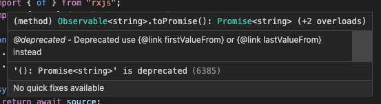

# New in RxJS 7

<aside class="notes">
  Thanks for joining, short talk, RxJS knowledge might help
</aside>

---

## Introduction

<div>
  
  <h1 style="font-size: 0.9em;">Martin van Dam</h1>
  <br />
  <small>Frontend Software Engineer @ Philips /  </small>
  <br />
  <small>@MrtnvDam / martin.van.dam@ordina.nl</small>
</div>

<aside class="notes">
  Developer for over 16 years, working with Functional, Reactive frontends, Codestar, Ordina, Philips
</aside>

---

## What is RxJS

- Reactive programming in the Frontend & Node
- A (better) way to manage data and events within your app.

<aside class="notes">
  Reactive Extensions, for multiple languages
</aside>

---

## Why RxJS

- Functional and Reactive
- Better readable code
- Data flow
- Easier and safer data transformations

---

## What's new in RxJS 7

- New methods
- New & renamed Operators
- Improved configuration options
- Improved typings

<aside class="notes">
  In this talk I will tell more about...
</aside>

---

### New method

`firstValueFrom`

- First value of stream
- Unsubscribes

<aside class="notes">
  Subscribes to the source Observable and returns a new Promise. When the first value from the source Observable is received it will resolve the Promise.
  When no value is received, it will reject with EmptyError.
</aside>

---

`.toPromise()`

```ts
// before v7
const abc = of("a", "b", "c");
const someValue = await abc.toPromise();
// -> 'c'
```

<aside class="notes">
  Tricky to manage yourself, wrapper required
  Does not work nice with empty observables (undefined), will not reject for example
</aside>

---



<aside class="notes">
  toPromise deprecated from v7, removed from v8
</aside>

---

`firstValueFrom`

```ts
const abc = of("a", "b", "c");
const firstValue = await firstValueFrom(abc);
// -> 'a'
```

---

```ts
// before v7
const empty = of();
const someValue = await empty.toPromise();
// -> undefined (?)
```

<aside class="notes">
  Does not reject!
</aside>

---

`firstValueFrom`

```ts
import { of, firstValueFrom } from "rxjs";

const empty = of();

try {
  await firstValueFrom(empty);
} catch (error) {
  // -> EmptyError: 'no elements in sequence'
}
```

---

### New method

`lastValueFrom`

- Last value of stream
- Resolves when completed

<aside class="notes">
  Subscribes to the source Observable and returns a new Promise. When the source Observable subsciptions closes it resolves the Promise.
  When no value is received, it will reject with EmptyError, just like `firstValueFrom`.
</aside>

---

`lastValueFrom`

```ts
const abc = of("a", "b", "c");
const firstValue = await lastValueFrom(abc);
// -> 'c'
```

---

`lastValueFrom`

```ts
const empty = of();

try {
  await lastValueFrom(empty);
} catch (error) {
  // -> EmptyError: 'no elements in sequence'
}
```

---

### New operator

`concatWith`

- Subscribes to input
- Waits until completion and subscribes to second

<aside class="notes">
  Emits all of the values from the source observable, then, once it completes, subscribes to each observable source provided, one at a time, emitting all of their values, and not subscribing to the next one until it completes.
</aside>

---

#### Example

`concatWith`

```ts
const clicks = fromEvent(document, "click");
const moves = fromEvent(document, "mousemove");

clicks.pipe(
  map(() => "click"),
  concatWith(moves.pipe(map(() => "move")))
);
// -> 'click', 'move', 'move', 'move'
```

---

### New operator

`switchScan`

- Proposed in 2017
- Uses `switchMap` under the hood
- Works like `reduce`

<aside class="notes">
  The new `switchScan` operator, a proposal from 2017 is now added.
  Applies an accumulator function over the source Observable where the accumulator function itself returns an Observable, emitting values only from the most recently returned Observable. It uses `switchMap` under the hood.
</aside>

---

#### Example

`switchScan`

```ts
const source = of(1, 2, 3);
const example = source.pipe(
  switchScan((acc, value) => {
    return of(acc + value);
  }, 0)
);
// -> 1, 3, 6
```

---

### Renamed operators

- Improved consistency & readability
- Deprecated in v7, removed in v8

<aside class="notes">
  A couple of operators are renamed for consistency and to make it more clear that the source Observable is also used in the operation.
  At this point it's still possible to use the former operator names but they are marked as deprecated.
</aside>

---

- `combineLatest` -> `combineLatestWith`
- `zip` -> `zipWith`
- `race` -> `raceWith`

---

### Extended configuration

`retry`

- Accepts config object
- `resetOnSuccess` option added

<aside class="notes">
  The `retry` operator now accepts a configuration object. We now can now also configure the operator to reset itself on a successful retry.
  The option `resetOnSuccess` defaults to `false`. You can also still use the former notation: `retry(2)`.
</aside>

---

#### Example `retry` configuration

```ts
const source = interval(1000);
const example = source.pipe(
  mergeMap((val) => {
    if (val > 5) {
      return throwError(() => new Error("Error!"));
    }
    return of(val);
  }),
  retry({
    count: 2,
    resetOnSuccess: true, // new!
  })
);
```

---

### Improved typings

`groupBy`

```ts
function isPerson(value: Person | Pet): value is Person {
  return value.hasOwnProperty("name");
}

const person: Person = { name: "Judy" };
const pet: Pet = { kind: "cat" };

const o = of(person, pet).pipe(
  groupBy(isPerson),
  mergeMap((group) => {
    if (group.key) {
      const inferred = group; // -> Person
      return inferred;
    } else {
      const inferred = group; // -> Pet
      return inferred;
    }
  })
);
```

---

### Dictonary support

`combineLatest`

```ts
// Before:
const nums$ = of(1, 2, 3);
const chars$ = of("a", "b", "c");
const bools$ = of(true, false, false);

const example = combineLatest(nums$, chars$, bools$);
// -> [ 3, 'c', true ]
```

---

```ts
// After:
const nums$ = of(1, 2, 3);
const chars$ = of("a", "b", "c");
const bools$ = of(true, false, false);

const example = combineLatest({
  number: nums$,
  character: chars$,
  boolean: bools$,
});
// -> { number: 3, character: 'c', boolean: true }
```

---

### Extended configuration

`timeout`

- Configuration options extended

<aside class="notes">
  The `timout` operator is now more configurable.
  Before; only the `due` and the `scheduler` could be provided.
</aside>

---

- `each`
- `first`
- `with`
- `meta`

<aside class="notes">
  - `each`: The time allowed between values from the source before timeout is triggered.
  - `first`: Point in time where the first value should have been emitted
  - `with`: A factory used to create observable to switch to when timeout occurs (i.e. throw error)
  - `meta`: Additional metadata you can provide to code that handles the timeout
</aside>

---

### Other noteworthy changes

- Memory usage reduced
- Improved typings for `filter`, `groupBy`, `combineLatest`
- Improved TestScheduler
- Minor breaking changes
- Bugfixes

<aside class="notes">
  - Previously retained values dropped
  - Improved typings
  - The animate helper accepts a marble diagram and each value emission in the diagram indicates when a “paint” occurs
  - toPromise can return undefined now, lift method dropped (only internal use), rest is stuff that's less critical / less regurarly used
  - Bugfixes
</aside>

---

## When can I use all this? 😍

<aside class="notes">
  Beta 9 out now; official release early 2021
</aside>

---

## Thanks!

And have fun with all the new goodies of RxJS 7! 👐

<aside class="notes">
  Thanks for joining, back to host, answer questions
</aside>

---

## Sources

- [RxJS 7 Roadmap](https://github.com/ReactiveX/rxjs/issues/5795)
- [RxJS Changelog](https://github.com/ReactiveX/rxjs/blob/master/CHANGELOG.md)
- [RxJS 7 release delay](https://twitter.com/BenLesh/status/1335776969611415552)

